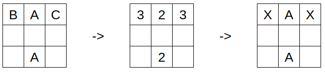
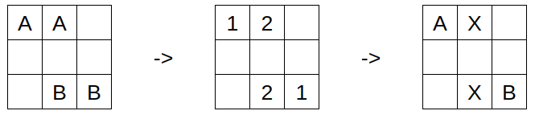

# Pravidlá

## Mapa sveta

Hra sa hrá na štvorcovej mriežke, kde každý štvorec môže mať jeden z troch
typov:

- Prázdny
- Voda - Na tento štvorec sa nemŕtve duše nemôžu pohybovať, ale neblokuje útoky.
- Hrobka

Hrobky slúžia ako základne hráčov. Sú nevyhnutné pre prežitie vašej bandy, preto
je dôležité ich chrániť.

## Herný cyklus

Hra sa hrá na ťahy. Herný cyklus pokračuje, kým nie je splnená aspoň jedna z
nasledujúcich podmienok na ukončenie hry:

- Žiadni hráči už nie sú nažive.
- Nažive je iba jeden hráč.
- Dosiahol sa limit ťahov.

Každý ťah pozostáva zo šiestich fáz, ktoré sa vyhodnocujú jedna po druhej v
tomto poradí:

### Fáza pohybu

Počas tejto fázy sú programy hráčov dotazované na príkazy pre ich nemŕtve duše.
Ak bot nezareaguje v časovom limite alebo sa počas tejto doby ukončí, je
okamžite zabitý.

Po odoslaní príkazov od všetkých botov sa všetky tieto príkazy vykonajú naraz.
Ak sa na rovnakom políčku nachádzajú viaceré nemŕtve duše, všetky sú
zabité (aj ak patria rovnakému hráčovi).

### Fáza útoku

Na účely útoku definujeme premennú `fear` pre každú nemŕtvu dušu. Táto hodnota
je počet nepriateľských duší v dosahu útoku tejto duše.

Ak má niektorá z protivníkových duší v tomto dosahu nižší alebo rovnaký `fear`
ako aktuálna duša, aktuálna duša v tomto kole zomrie. Tieto porovnávania sa
vykonávajú pre všetky duše naraz, takže výsledok nezávisí na poradí.

#### Príklady

Toto môže byť trochu mätúce, takže si prejdime niekoľko príkladov. Vzdialenosť
útoku nemŕtvych duší na druhú v hre je 5, takže tento počet použijeme v
príkladoch.



Tu bojujú tri rôzne bandy nemŕtvych (A, B a C). Pretože nemŕtvi z bandy A sú
spolu, ich `fear` je iba 2 a ich nepriatelia majú `fear` 3. Preto
všetky nemŕtve duše okrem tých z bandy A zomrú po fáze boja.



V tomto príklade sú vonkajšie nemŕtve duše príliš ďaleko na boj, takže ich
`fear` je iba 1. Keďže `fear` vnútorných nemŕtvych duší je 2, tieto
nemŕtve duše sú označené na zabitie.

Tu sa nachádza pseudokód, ktorý ilustruje tento proces:

```py
for shade in alive_shades:
    for other_shade in alive_shades:
        if different_teams(shade, other_shade) and in_range(shade, other_shade):
            fear[shade] += 1

for shade in alive_shades:
    for other_shade in alive_shades:
        if different_teams(shade, other_shade) and in_range(shade, other_shade):
            if fear[shade] >= fear[other_shade]:
                mark(shade)
```

### Fáza ničenia

Ak niektoré nemŕtve duše prežili predchádzajúcu fázu na nepriateľskej hrobke, v
tejto fáze túto hrobku zničia. To znamená, že hrobka už nebude môcť
spawnovať nové duše. Okrem toho útočník získa body a bývalý vlastník
hrobky utrpí penalizáciu (pozri Skórovanie).

### Fáza spawnovania duší

Každá človek, ktorého nemŕtve duše "konvertujú" zodpovedá jednej novej nemŕtvej
duši. Pre každého hráča sa vytvorí zoznam všetkých jeho hrobiek, na ktorých sa
nenachádza duša, a tento zoznam sa náhodne premieša. Potom sa pre každého
"konvertovaného" človeka, ktorého má hráč uloženého, spawnuje jedna duša na
hrobke.

Konvertovaný ľudia, ktorí sa nepremenili na nemŕtve duše, sa prenášajú do
ďalšieho ťahu.

### Fáza konvertovania ľudí

Teraz je čas konvertovať ľudí roztrúsených po mape. Ak je nejaká nemŕtva duša v
dosahu človeka, tento človek bude označený jeho bandou. Hráč skonvertuje
všetkých ľudí, ktorí boli označení iba jeho bandou. Ak je človek označený dvoma
alebo viacerými bandami, jeho duša počas chaosu uprchne a nezíska ju ani jeden
z hráčov.

### Fáza rodenia ľudí

V tejto fáze sa na náhodných nezablokovaných políčkach mapy objavia noví
ľudia. 

## Eliminácia hráčov

Hráči môžu byť eliminovaní z hry nasledujúcimi spôsobmi:

- Neodpovedali s príkazmi (prekročený časový limit alebo bot spadol).
- Nemajú žiadne nemŕtve duše a nemôžu spawnovať ďalšie (všetky ich hrobky sú
  zničené alebo nemajú uložených "skonvertovaných" ľudí).

Po eliminácii hráča už nie je dotazovaný na príkazy. Jeho živé duše a
hrobky však zostávajú v hre, takže môže stále stratiť body, ak je jedna z
jeho hrobiek zničená.

## Skórovanie

Každý hráč začína hru s bodmi rovnými počtu hrobiek, s ktorými začína. Keď je
hrobka zničená, vlastník stratí 1 bod a útočník získa 2 body.

Ďalšie body získavate, ak prežijete dlhšie ako ostatní hrá. Keď je nejaký hráč
eliminovaný z hry, všetci žijúci hráči získajú 1 bod.
